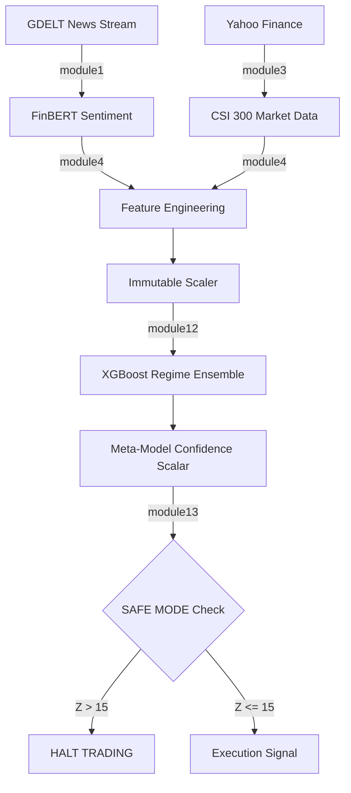

# System Architecture

```mermaid
graph TD
    A[GDELT News Stream] -->|module1| B[FinBERT Sentiment]
    C[Yahoo Finance] -->|module3| D[CSI 300 Market Data]
    B -->|module4| E[Feature Engineering]
    D -->|module4| E
    E --> F[Immutable Scaler]
    F -->|module12| G[XGBoost Regime Ensemble]
    G --> H[Meta-Model Confidence Scalar]
    H -->|module13| I{SAFE MODE Check}
    I -->|Z > 15| J[HALT TRADING]
    I -->|Z <= 15| K[Execution Signal]
```
