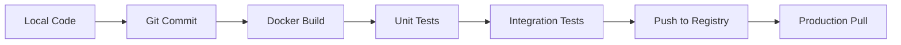

# Deployment Workflow

```mermaid
graph LR
    A[Local Code] --> B[Git Commit]
    B --> C[Docker Build]
    C --> D[Unit Tests]
    D --> E[Integration Tests]
    E --> F[Push to Registry]
    F --> G[Production Pull]
```
