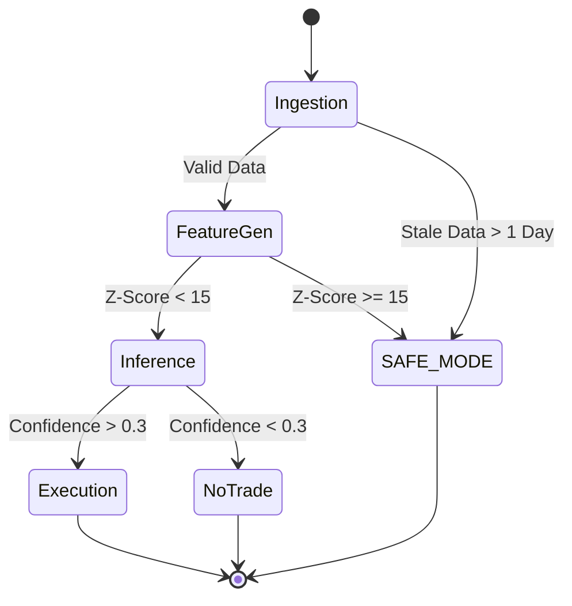

# Execution Lifecycle

```mermaid
stateDiagram-v2
    [*] --> Ingestion
    Ingestion --> FeatureGen : Valid Data
    Ingestion --> SAFE_MODE : Stale Data > 1 Day
    FeatureGen --> Inference : Z-Score < 15
    FeatureGen --> SAFE_MODE : Z-Score >= 15
    Inference --> Execution : Confidence > 0.3
    Inference --> NoTrade : Confidence < 0.3
    Execution --> [*]
    NoTrade --> [*]
    SAFE_MODE --> [*]
```
