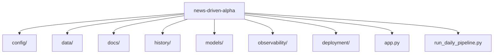

# Folder Tree

```mermaid
graph TD
    Root[news-driven-alpha] --> A[config/]
    Root --> B[data/]
    Root --> C[docs/]
    Root --> D[history/]
    Root --> E[models/]
    Root --> F[observability/]
    Root --> G[deployment/]
    Root --> H[app.py]
    Root --> I[run_daily_pipeline.py]
```
