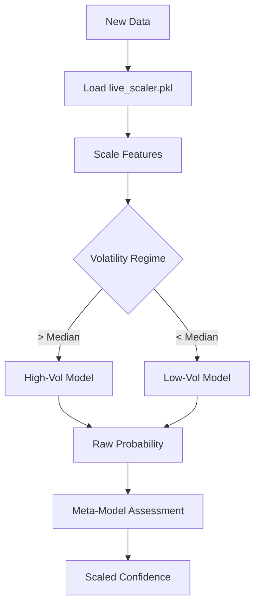

# Inference Workflow

```mermaid
graph TD
    A[New Data] --> B[Load live_scaler.pkl]
    B --> C[Scale Features]
    C --> D{Volatility Regime}
    D -->|> Median| E[High-Vol Model]
    D -->|< Median| F[Low-Vol Model]
    E --> G[Raw Probability]
    F --> G
    G --> H[Meta-Model Assessment]
    H --> I[Scaled Confidence]
```
