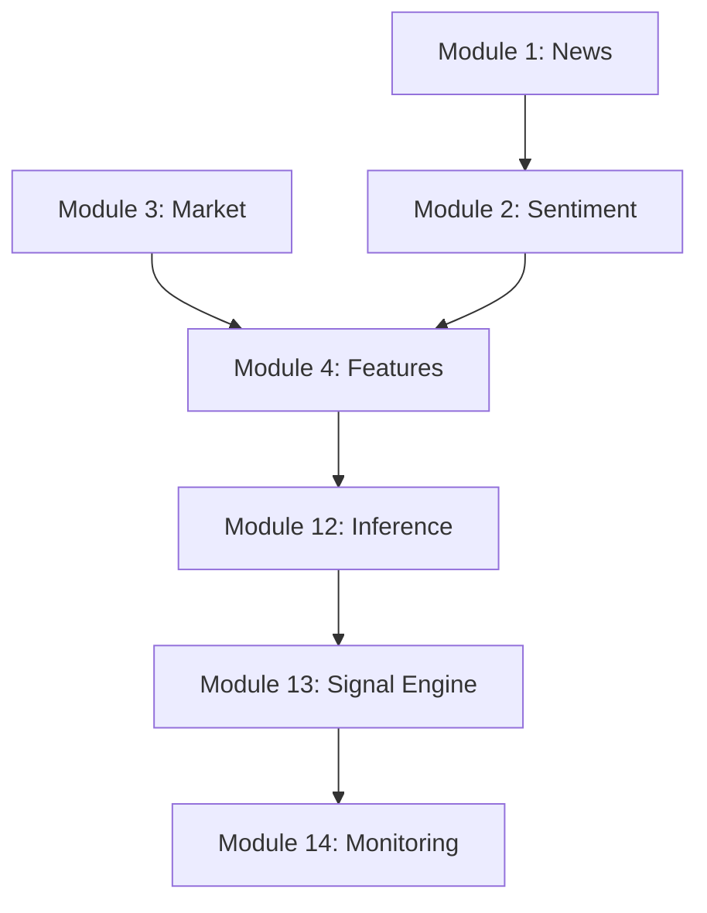

# Module Dependency Graph

```mermaid
graph TD
    M1[Module 1: News] --> M2[Module 2: Sentiment]
    M3[Module 3: Market] --> M4[Module 4: Features]
    M2 --> M4
    M4 --> M12[Module 12: Inference]
    M12 --> M13[Module 13: Signal Engine]
    M13 --> M14[Module 14: Monitoring]
```
