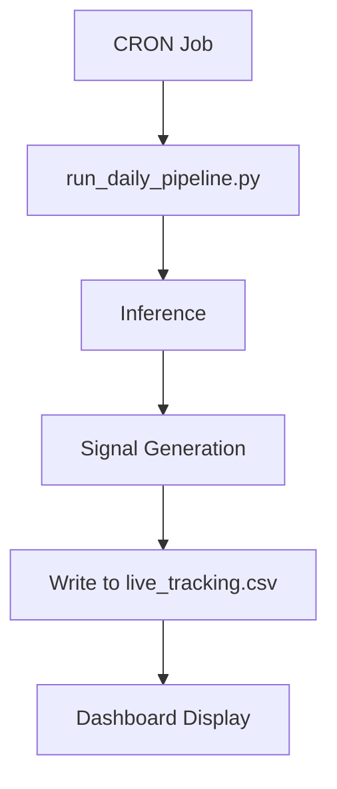

# Paper Trading Workflow

```mermaid
graph TD
    A[CRON Job] --> B[run_daily_pipeline.py]
    B --> C[Inference]
    C --> D[Signal Generation]
    D --> E[Write to live_tracking.csv]
    E --> F[Dashboard Display]
```
