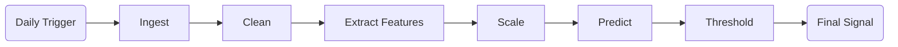

# Pipeline Flowchart

```mermaid
flowchart LR
    A(Daily Trigger) --> B[Ingest]
    B --> C[Clean]
    C --> D[Extract Features]
    D --> E[Scale]
    E --> F[Predict]
    F --> G[Threshold]
    G --> H(Final Signal)
```
