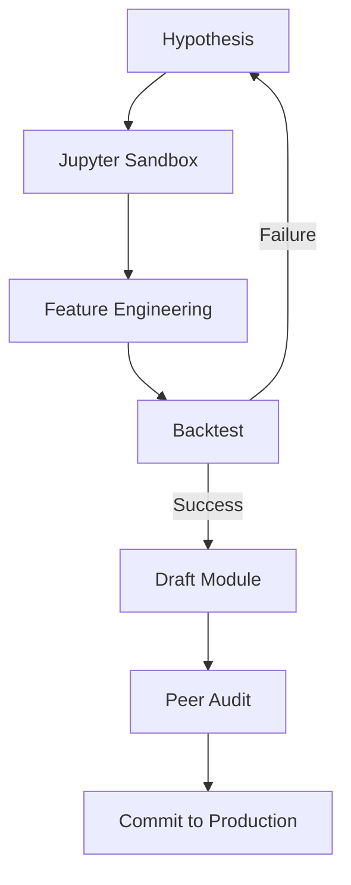

# Research Workflow

```mermaid
graph TD
    A[Hypothesis] --> B[Jupyter Sandbox]
    B --> C[Feature Engineering]
    C --> D[Backtest]
    D -->|Success| E[Draft Module]
    D -->|Failure| A
    E --> F[Peer Audit]
    F --> G[Commit to Production]
```
