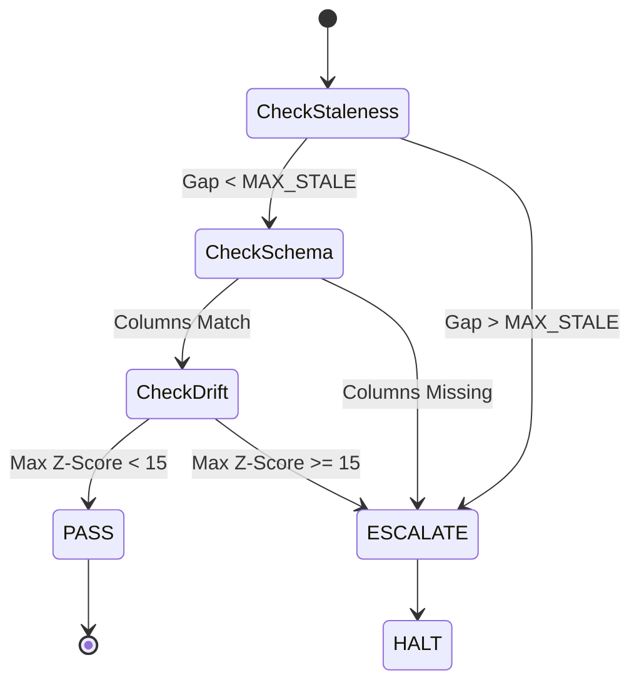

# SAFE MODE Workflow

```mermaid
stateDiagram-v2
    [*] --> CheckStaleness
    CheckStaleness --> CheckSchema : Gap < MAX_STALE
    CheckStaleness --> ESCALATE : Gap > MAX_STALE
    CheckSchema --> CheckDrift : Columns Match
    CheckSchema --> ESCALATE : Columns Missing
    CheckDrift --> PASS : Max Z-Score < 15
    CheckDrift --> ESCALATE : Max Z-Score >= 15
    PASS --> [*]
    ESCALATE --> HALT
```
