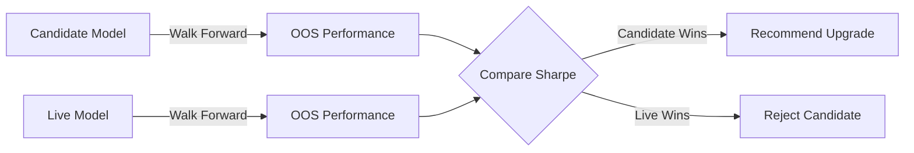

# Shadow Model Workflow

```mermaid
graph LR
    A[Candidate Model] -->|Walk Forward| B[OOS Performance]
    C[Live Model] -->|Walk Forward| D[OOS Performance]
    B --> E{Compare Sharpe}
    D --> E
    E -->|Candidate Wins| F[Recommend Upgrade]
    E -->|Live Wins| G[Reject Candidate]
```
