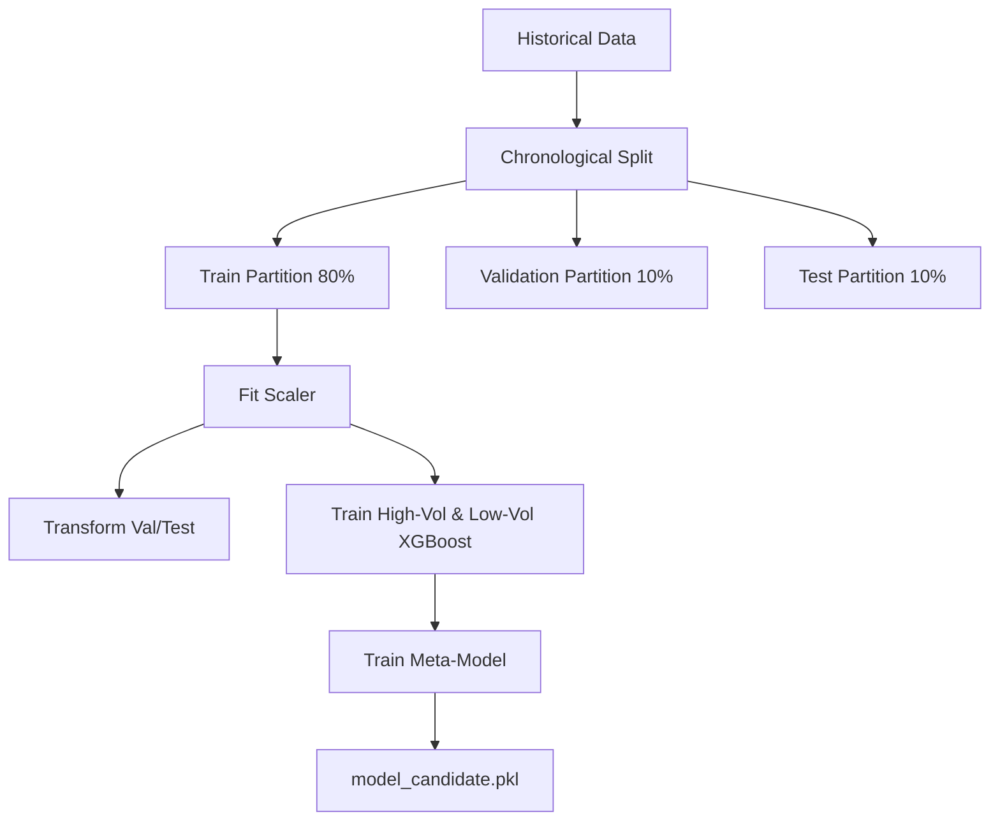

# Training Workflow

```mermaid
graph TD
    A[Historical Data] --> B[Chronological Split]
    B --> C[Train Partition 80%]
    B --> D[Validation Partition 10%]
    B --> E[Test Partition 10%]
    C --> F[Fit Scaler]
    F --> G[Transform Val/Test]
    F --> H[Train High-Vol & Low-Vol XGBoost]
    H --> I[Train Meta-Model]
    I --> J[model_candidate.pkl]
```
